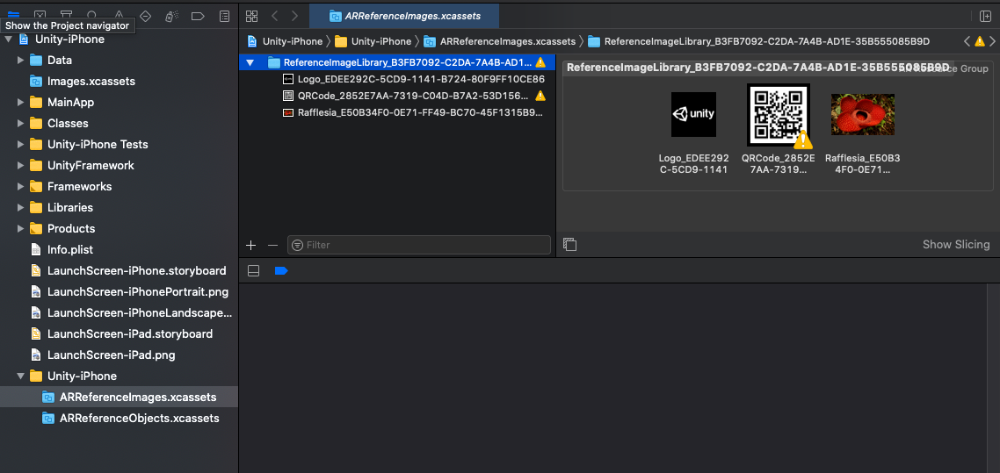

# Image tracking

This page is a supplement to the AR Foundation [Image tracking](xref:arfoundation-image-tracking) manual. The following sections only contain information about APIs where ARKit exhibits unique platform-specific behavior.

[!include]

## Optional feature support

ARKit implements the following optional features of AR Foundation's [XRImageTrackingSubsystem](xref:UnityEngine.XR.ARSubsystems.XRImageTrackingSubsystem):

| Feature | Descriptor Property | Supported |
| :------ | :--------------- | :----------: |
| **Moving images** | [supportsMovingImages](xref:UnityEngine.XR.ARSubsystems.XRImageTrackingSubsystemDescriptor.supportsMovingImages) | iOS 12+ |
| **Requires physical image dimensions** | [requiresPhysicalImageDimensions](xref:UnityEngine.XR.ARSubsystems.XRImageTrackingSubsystemDescriptor.requiresPhysicalImageDimensions) | Yes |
| **Mutable library** | [supportsMutableLibrary](xref:UnityEngine.XR.ARSubsystems.XRImageTrackingSubsystemDescriptor.supportsMutableLibrary) | Yes |
| **Image validation** | [supportsImageValidation](xref:UnityEngine.XR.ARSubsystems.XRImageTrackingSubsystemDescriptor.supportsImageValidation) | iOS 13+ |

## Reference image libraries

To use image tracking on ARKit, you first need to create a Reference Image Library, as outlined in AR Foundation's [Configure a reference image library](xref:arfoundation-image-tracking-reference-image-libraries) for instructions.

### ARKit reference image library compilation

During an iOS player build, this package compiles the reference image libraries into the necessary runtime data required by ARKit. There are two ways to compile reference image libraries:

1. This package attempts to run a command line tool which generates the binary data. This data is then added to the [XRReferenceImageLibrary](xref:UnityEngine.XR.ARSubsystems.XRReferenceImageLibrary) asset. This technique requires macOS with Xcode installed.
2. This package can also create an AR Resource Group in the generated Xcode project:
 The resource group and the images within it are named according to the name the user specifies in the Unity Editor concatenated with a GUID so the image can be uniquely identified at runtime.
 This process can be performed on any desktop platform.

> [!NOTE]
> **Use reference image libraries with AssetBundles**
>
> To use an XRReferenceImageLibrary in an [AssetBundle](xref:um-asset-bundles-intro), the AssetBundle must be built on macOS with Xcode installed. This is required because when ARKit creates an AR Resource Group, it builds the reference images into the Player, not the XRReferenceImageLibrary asset.

### AssetBundles

You can store reference image libraries in AssetBundles and load them runtime, but setting up your project to build the AssetBundles correctly requires special instructions. Refer to [Use reference image libraries with AssetBundles](xref:arfoundation-image-tracking-assetbundles) in AR Foundation for more information.

### Image format requirements

ARKit's AR Reference Images can be either JPEG or PNG files. If a different type of source texture is specified in the `XRReferenceImageLibrary`, then AR Foundation attempts to convert the texture to a PNG for ARKit to use. Exporting a `Texture2D` to PNG can fail for several reasons. For instance, the texture must be marked both readable and uncompressed in the texture importer settings.

If you plan to use the texture at runtime (and not just as a source asset for the reference image), create a separate PNG or JPEG as the source asset, because those texture import settings can have undesirable performance or memory impacts at runtime.

### Reference image dimensions

ARKit requires image dimensions. When you specify the dimensions for a reference image, only the image's width is provided to ARKit. Xcode computes the height from the image's aspect ratio.

[!include]
