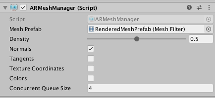
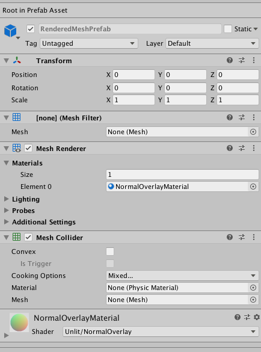

# Meshing

ARKit new provides support for the scene reconstruction feature that became available in ARKit 3.5 and is enabled on the new iPad Pro with LiDAR scanner.

## Requirements

This new mesh functionality requires Xcode 11.4 or later, and it only works on iOS devices with the LiDAR scanner, such as the new iPad Pro.

This ARKit package requires Unity 2019.3 or later.

## Using meshing in a scene

Using the LiDAR sensor, ARKit scene reconstruction scans the environment to create mesh geometry representing the real world environment. Additionally, ARKit provides an optional classification of each triangle in the scanned mesh. The per-triangle classification identifies the type of surface corresponding to the triangle's location in the real world.

To use ARKit meshing with AR Foundation, you need to add the [`ARMeshManager`](https://docs.unity3d.com/Packages/com.unity.xr.arfoundation@4.0/api/UnityEngine.XR.ARFoundation.ARMeshManager.html) component to your scene.

### Mesh Prefab

You need to set the [`meshPrefab`](https://docs.unity3d.com/Packages/com.unity.xr.arfoundation@4.0/api/UnityEngine.XR.ARFoundation.ARMeshManager.html#UnityEngine_XR_ARFoundation_ARMeshManager_meshPrefab) to a prefab that is instantiated for each scanned mesh. The [`meshPrefab`](https://docs.unity3d.com/Packages/com.unity.xr.arfoundation@4.0/api/UnityEngine.XR.ARFoundation.ARMeshManager.html#UnityEngine_XR_ARFoundation_ARMeshManager_meshPrefab) must contain at least a [`MeshFilter`](https://docs.unity3d.com/ScriptReference/MeshFilter.html) component.

If you want to render the scanned meshes, you will need add a [`MeshRenderer`](https://docs.unity3d.com/ScriptReference/MeshRenderer.html) component and a [`Material`](https://docs.unity3d.com/ScriptReference/Material.html) component to the [`meshPrefab`](https://docs.unity3d.com/Packages/com.unity.xr.arfoundation@4.0/api/UnityEngine.XR.ARFoundation.ARMeshManager.html#UnityEngine_XR_ARFoundation_ARMeshManager_meshPrefab)'s game object.

If you want to have virtual content that interacts physically with the real world scanned meshes, you will need to add [`MeshCollider`](https://docs.unity3d.com/ScriptReference/MeshCollider.html) component to the [`meshPrefab`](https://docs.unity3d.com/Packages/com.unity.xr.arfoundation@4.0/api/UnityEngine.XR.ARFoundation.ARMeshManager.html#UnityEngine_XR_ARFoundation_ARMeshManager_meshPrefab)'s game object.

This image demonstrates a mesh prefab configured with the required [`MeshFilter`](https://docs.unity3d.com/ScriptReference/MeshFilter.html) component, an optional [`MeshCollider`](https://docs.unity3d.com/ScriptReference/MeshCollider.html) component to allow for physics interactions, and optional [`MeshRenderer`](https://docs.unity3d.com/ScriptReference/MeshRenderer.html) & [`Material`](https://docs.unity3d.com/ScriptReference/Material.html) components to render the mesh.

### Normals

As ARKit is constructing the mesh geometry, the vertex normals for the mesh are calculated. Disable [`normals`](https://docs.unity3d.com/Packages/com.unity.xr.arfoundation@4.0/api/UnityEngine.XR.ARFoundation.ARMeshManager.html#UnityEngine_XR_ARFoundation_ARMeshManager_normals) if you do not require the mesh vertex normals to save on memory and CPU time.

### Concurrent Queue Size

To avoid blocking the main thread, the tasks of converting the ARKit mesh into a Unity mesh and creating the physics collision mesh (if the [`meshPrefab`](https://docs.unity3d.com/Packages/com.unity.xr.arfoundation@4.0/api/UnityEngine.XR.ARFoundation.ARMeshManager.html#UnityEngine_XR_ARFoundation_ARMeshManager_meshPrefab)'s game object contains a [`MeshCollider`](https://docs.unity3d.com/ScriptReference/MeshCollider.html) component) are moved into a job queue processed on a background thread. [`concurrentQueueSize`](https://docs.unity3d.com/Packages/com.unity.xr.arfoundation@4.0/api/UnityEngine.XR.ARFoundation.ARMeshManager.html#UnityEngine_XR_ARFoundation_ARMeshManager_concurrentQueueSize) specifies the number of meshes to be processed concurrently.

### Other `ARMeshManager` settings

For the ARKit implementation, only these 3 settings affect the performance and output of ARKit meshing.

## Sample Scenes

Three sample scenes exist in the [arfoundation-samples](https://github.com/Unity-Technologies/arfoundation-samples) repository:

- The **ClassificationMeshes** scene uses the mesh classification functionality to generate colored overlays on top of the real world. Each color represents a unique surface typed detected by ARKit.

- The **NormalMeshes** scene renders an overlay on top of the real world. The color of the mesh varies based on the normal of the mesh geometry.

- The **OcclusionMeshes** scene may appear to be doing nothing at first. However, it is rendering a depth texture on top of the scene based on the real world geometry. This allows for the real world to occlude virtual content. The scene has a script on it that fires a red ball into the scene when you tap. You will see the occlusion working by firing the red balls into a space which you can then move the device camera behind some other real world object to see that the virtual red balls are occluded by the real world object.

## Meshing behaviors

**Do note** that it is normal for about 4 seconds to elapse after the Made With Unity logo disappears (or when a new AR Session starts) before the scanned meshes start to show up.

Additionally, the LiDAR scanner alone may produce a slightly uneven mesh on a real-world surface. If you add and enable a [`ARPlaneManager`](https://docs.unity3d.com/Packages/com.unity.xr.arfoundation@4.0/api/UnityEngine.XR.ARFoundation.ARPlaneManager.html) to your scene, then ARKit considers that plane information when constructing a mesh. ARKit smooths out the mesh where it detects a plane on that surface.

## Additional information

For more information about ARKit 3.5, see [Introducing ARKit 3.5](https://developer.apple.com/augmented-reality/arkit/).

For more information about scene reconstruction, see [Visualizing and Interacting with a Reconstructed Scene](https://developer.apple.com/documentation/arkit/world_tracking/visualizing_and_interacting_with_a_reconstructed_scene?language=objc).
