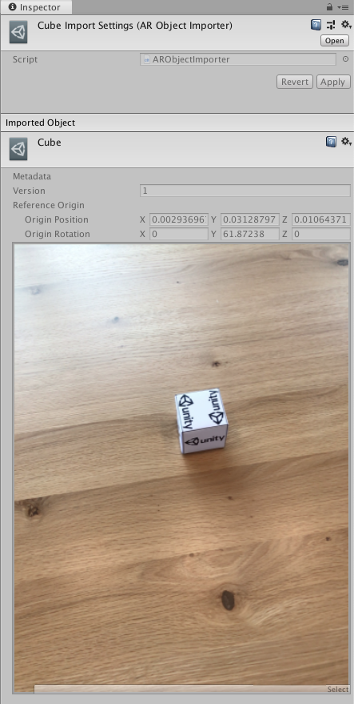
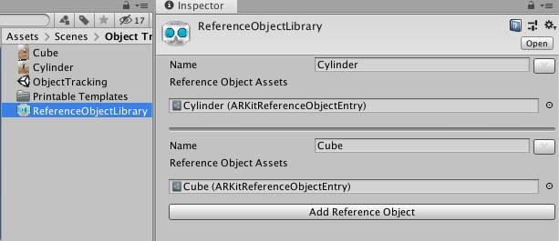

# Object tracking

To use object tracking on ARKit, you first need to create a Reference Object Library. See the [AR Subsystems documentation on object tracking](xref:arsubsystems-object-tracking-subsystem) for instructions.

Next, you need to create an ARKit-specific version of the reference object. The [Scanning and Detecting 3D Objects](https://developer.apple.com/documentation/arkit/scanning_and_detecting_3d_objects) page on Apple's developer website allows you to download an app that you can run on an iOS device to produce such a scan. Note that this is a third-party application and Unity is not involved in its development.

The scanning app produces a file with the extension `.arobject`. Drag each `.arobject` file into your Unity project, and Unity generates an `ARKitReferenceObjectEntry` for it.

You should see some metadata and a preview image of the scan.

You can now add the `.arobject` to a reference object in your Reference Object Library:

[!include]
