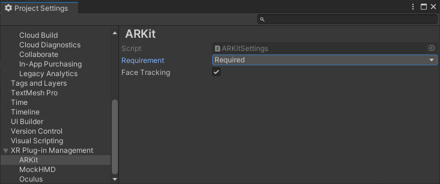

# About Apple ARKit XR Plug-in

Use the Apple ARKit XR Plug-in package to enable ARKit support via Unity's multi-platform XR API. This package implements the following XR Subsystems:

* [Session](xref:arsubsystems-session-subsystem)
* [Camera](xref:arsubsystems-camera-subsystem)
* [Depth](xref:arsubsystems-depth-subsystem)
* [Input](xref:UnityEngine.XR.XRInputSubsystem)
* [Planes](xref:arsubsystems-plane-subsystem)
* [Raycast](xref:arsubsystems-raycast-subsystem)
* [Anchors](xref:arsubsystems-anchor-subsystem)
* [Image tracking](xref:arsubsystems-image-tracking-subsystem)
* [Environment probes](xref:arsubsystems-environment-probe-subsystem)
* [Body tracking](xref:UnityEngine.XR.ARSubsystems.XRHumanBodySubsystem)
* [Occlusion](xref:arsubsystems-occlusion-subsystem)
* [Participant](xref:arsubsystems-participant-subsystem)
* [Meshes](xref:arsubsystems-mesh-subsystem)
* [Face tracking](xref:arsubsystems-face-subsystem)

This version of Apple ARKit XR Plug-in supports the following features:

* Device localization
* Horizontal plane detection
* Vertical plane detection
* Point clouds
* Pass-through camera view
* Light estimation
* Anchors
* Hit testing
* Session management
* Image tracking
* Object tracking
* Environment probes
* Participant tracking
* Meshes (also known as Scene Reconstruction)
* Occlusion

> [!IMPORTANT]
> Apple's App Store rejects any app that contains certain face tracking-related symbols in its binary if the app developer doesn't intend to use face tracking. To avoid ambiguity, [face tracking](xref:arsubsystems-face-subsystem) support is available only when face tracking is enabled. Go to **Edit** &gt; **Project Settings** &gt; **XR Plug-in Management** &gt; **ARKit** to enable or disable face tracking.

# Installing Apple ARKit XR Plug-in

To install this package, follow the instructions in the [Package Manager documentation](https://docs.unity3d.com/Packages/com.unity.package-manager-ui@latest/index.html).

In addition, install the AR Foundation package, which uses Apple ARKit XR Plug-in and provides many useful scripts and Prefabs. For more information about this package, see the [AR Foundation documentation](https://docs.unity3d.com/Packages/com.unity.xr.arfoundation@latest).

# Using Apple ARKit XR Plug-in

The Apple ARKit XR Plug-in implements the native iOS endpoints required for building Handheld AR apps using Unity's multi-platform XR API. However, this package doesn't expose any public scripting interface of its own. In most cases, you should use the scripts, Prefabs, and assets provided by AR Foundation as the basis for your Handheld AR apps.

Including the Apple ARKit XR Plug-in also includes source files, static libraries, shader files, and plug-in metadata.

ARKit requires iOS 11.0. Some specific features require later versions (see below).

## Build settings

To access ARKit build settings, from Unity's main menu, go to **Edit &gt; Project Settings**, then navigate to the **XR Plug-in Management** menu and enable the **ARKit** provider, as shown in the screenshot below:

This creates an `ARKitSettings` asset that you can access under **XR Plug-in Management &gt; ARKit**, as shown in the screenshot below:

### Requiring AR

You can flag ARKit as either required or optional. By default, ARKit is required, which means your app can only be installed on AR-supported devices and operating systems (iOS 11.0 and above). If you specify that AR is optional, your app can be installed on all iOS devices.

#### Targeting 32-bit devices

To target 32-bit devices, OpenGLES2 must be included in the list of Graphics APIs. From Unity's main menu, go to **Edit &gt; Project Settings**, then navigate to **Player &gt; Other Settings &gt; Graphics APIs**, as shown in the screenshot below:

# Technical details

## Requirements

This version of Apple ARKit XR Plug-in is compatible with the following versions of the Unity Editor:

* 2021.2
* 2022.1

You must use Xcode 12 or later when compiling an iOS Player that includes this package.

## Known limitations

* Color correction is not available as an RGB Value (only as color temperature).

## Package contents

This version of Apple ARKit XR Plug-in includes:

* A static library which provides implementation of the XR Subsystems listed above
* An Objective-C source file
* A shader used for rendering the camera image
* A plug-in metadata file

For more code examples, see the [AR Foundation Samples repo](https://github.com/Unity-Technologies/arfoundation-samples).

[!include]
